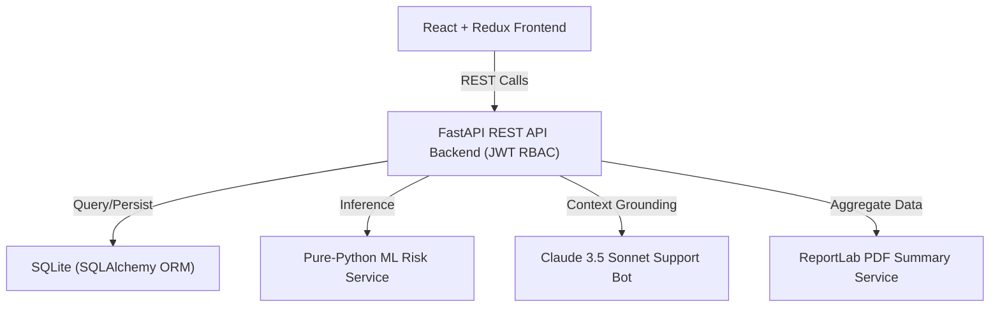

# AI-Powered Patient Risk Prediction System

> [!WARNING]
> **Clinical Safety & Legal Disclaimer:** This is a learning, prototype portfolio project using synthetic data only. It is **not** HIPAA-compliant, not production-ready, and is **not** intended for real patient diagnostic, treatment, or clinical use. The incorporated chatbot and predictions represent supportive explanation tools and do not substitute a professional medical consultation.

This full-stack application enables patients and medical practitioners to evaluate diabetes risk scores based on physiological vitals, record diagnostic lab files, track clinical history logs, and interact with an AI chatbot helper that explains risk metrics in plain language.

---

## Technical Stack & Architecture



*   **Backend:** FastAPI, SQLAlchemy ORM (swappable to PostgreSQL), JWT Auth (bcrypt hashing, HTTPBearer tokenization).
*   **Machine Learning:** Deterministic `SimpleLogisticRegression` classifier written in pure Python (to bypass Windows AppLocker/Application Control policies blocking Scipy DLLs), trained on the Pima Indians Diabetes Dataset (77.27% accuracy).
*   **AI Chatbot:** Claude 3.5 Sonnet (via server-side Anthropic API, keeping key secure).
*   **PDF Generation:** `reportlab` layout library.
*   **Frontend:** React, Redux Toolkit, React Router, Recharts, and custom Glassmorphism CSS styling.

---

## Directory Structure

```text
backend/
├── app/
│   ├── api/          # Routers (auth, patients, appointments, medical_history, predictions, reports, chat, pdf)
│   ├── models/       # SQLAlchemy models.py
│   ├── schemas/      # Pydantic schemas (auth, patients, appointments, medical_history, predictions, reports)
│   ├── auth/         # JWT keys, bcrypt, role-check dependencies
│   ├── ml/           # Model load/inference wrapper and pure-Python class definition
│   ├── services/     # Rule-based doctor referral engine
│   ├── database/     # DB engine and SessionLocal config
│   └── main.py       # FastAPI entrypoint and CORS mapping
├── uploads/reports/  # Diagnostic PDF/CSV reports storage
├── models/           # diabetes_model.pkl binary
└── requirements.txt  # Python requirements list

frontend/
├── src/
│   ├── components/   # ChatWidget.jsx & ChatWidget.css floating widget
│   ├── pages/        # Login, Dashboard (hub), PatientDashboard, DoctorDashboard, Patients, Predictions
│   ├── redux/        # store.js & authSlice.js authentication state
│   ├── services/     # api.js fetch client
│   ├── App.jsx       # Layout, nav bar, and routing guards
│   ├── index.css     # CSS variables & typography tokens
│   └── main.jsx      # React mounting
├── index.html        # Outfit/Inter fonts loader
└── package.json      # Node dependencies
```

---

## Development Setup

### 1. Backend Setup

1.  Navigate to the `backend/` directory:
    ```bash
    cd backend
    ```
2.  Create and activate a virtual environment:
    ```bash
    python -m venv .venv
    .\.venv\Scripts\activate
    ```
3.  Install requirements:
    ```bash
    pip install -r requirements.txt
    ```
4.  Run offline model training to download Pima Indians dataset and pickle the model:
    ```bash
    python train_model.py
    ```
5.  Set your environment variables (optional, fallback defaults are included):
    *   `ANTHROPIC_API_KEY`: Your Claude API token. (If not set, falls back to a mock assistant response).
6.  Start the FastAPI backend server:
    ```bash
    uvicorn app.main:app --reload --reload-dir app --host 127.0.0.1 --port 8000
    ```

### 2. Frontend Setup

1.  Navigate to the `frontend/` directory:
    ```bash
    cd ../frontend
    ```
2.  Install dependencies:
    ```bash
    npm install
    ```
3.  Start the local React development server:
    ```bash
    npm run dev
    ```
4.  Open [http://localhost:5173](http://localhost:5173) in your browser.

---

## Safety & Feature Scopes

### 1. Deterministic Doctor Referrals (Rule Engine)
Specialist recommendations are implemented via standard clinical vital boundaries (if/else checks) and are explicitly documented as **deterministic rules**:
*   *Glucose > 140 mg/dL or Risk > 80%* $\rightarrow$ Refer to Endocrinologist.
*   *Diastolic BP > 90 mm Hg* $\rightarrow$ Refer to Cardiologist.
*   *BMI >= 30* $\rightarrow$ Refer to Nutritionist/Dietitian.
*   *Default* $\rightarrow$ Refer to General Practitioner.

> [!NOTE]
> **AI-Based Referral Engine [TODO]:** A collaborative filtering model trained on doctor feedback data represents a future enhancement, kept distinct from this prototype's simple rule engine.

### 2. Claude Chatbot Grounding
When explaining prediction parameters, the chatbot retrieves the patient's latest row from the `predictions` table and populates Claude's system prompt context with parameters (e.g. glucose, blood pressure) to explain the numbers without fabricating medical advice.

### 3. File Upload Guards
Lab report files are restricted:
*   Allowed file extensions: `.pdf` and `.csv` only.
*   Allowed file size: $\le 5$ MB.
